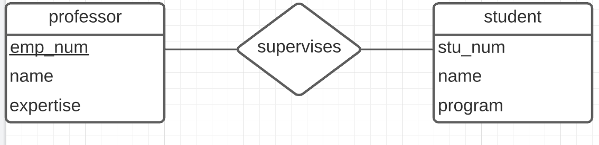
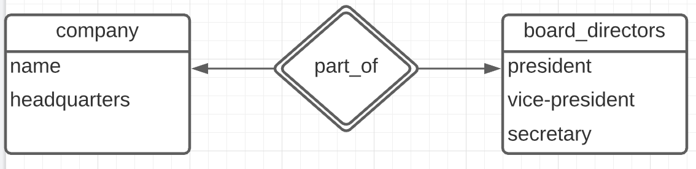
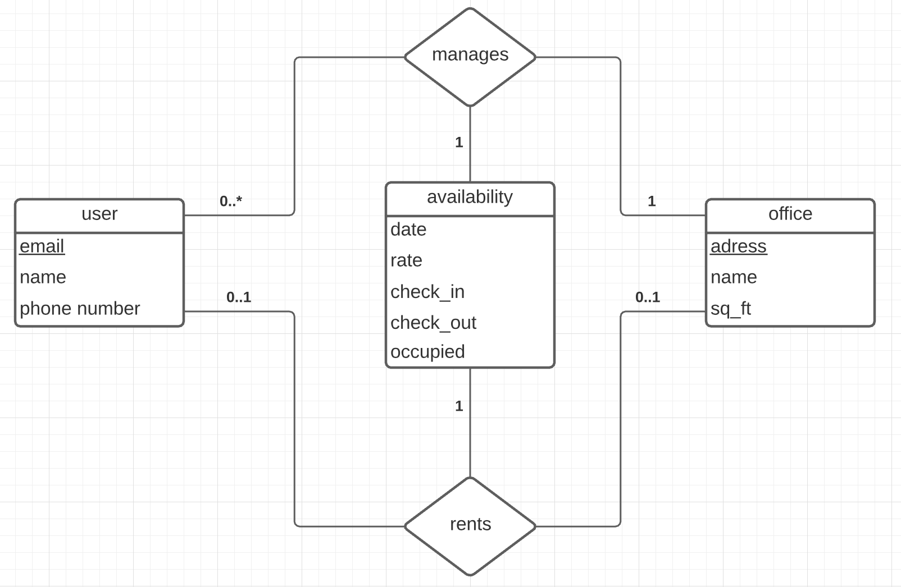

# Part A: E-R Models

## A1: Relations, Cardinality and Participation
a) A student can be supervised by any number of professors, and a professor can supervise any number of students. A student has a student number, name and enrolled in a specific program. A professor has an employee number, name and area of expertise.



b) All course sections must be assigned to a course. A course has a department code (e.g. CSI or SEG) and a course number (e.g. 2532 or 4105). A course section is uniquely defined by section name (e.g. A or B or C), semester (e.g. Winter), a year and the course itself. A course section depends on its course.


c) A company has a name and headquarters (country). A board of directors has a president, a vice-president, and a secretary. A company can have at most one board of directors (but it does not require one). All board of directors must have one and only one associated company to manage.



## A2: System Design




## A3: Relational Algebra
Find all office spaces in Ottawa that are available March 2, 2020

```
σ adress = 'Ottawa' ^ date = '2020-03-02' (availability x office)
```

Find all users (name and email) and the property details (name, and city) and the rental information (date, and daily rate) of all rentals during the month of January 2020.

```
π user.name, email, office.name, city, rate (σ date = '2020-02') (user x availibility x office)

```


# Part B: SQL

## B1. Reading SQL Queries

 a)
 
 | name | experience|
 | --- | --- |
 | andrew | 3 |
 | august | 1 |
 | hayden | 2 |

 
b)

| name | released_date |
| --- | --- |
| MS word | 2011-01-20 |
| Sketch  | 2016-06-15 |


c)

The query wasn't working since it was missing 'id' in the GROUP BY section.

```sql
WITH users_2019 (id, name, join_date) AS (SELECT *
FROM users
WHERE join_date BETWEEN '2019-01-01' AND '2019-12-31') SELECT id,
name,
count(licenses.access_code) AS num FROM users_2019
LEFT JOIN licenses ON licenses.user_id = id GROUP BY id, name
ORDER BY num DESC;
```

## B2. Writing SQL Queries
a)

 Find the names of all users that joined before Jan 1, 2020.

```sql
SELECT name FROM users
	WHERE join_date < '2020-01-01';
```

b)

Show the number of software licenses of each user (even those without any licenses). Sort the results by the number of licenses (most to least) and then by name (A - Z)

```sql
SELECT name, COUNT(user_id) as num_soft
	FROM users
	LEFT JOIN licenses ON users.id = licenses.user_id
GROUP BY name, id having count(*) > 0
ORDER BY COUNT(user_id) DESC, name ASC;
```

c)

Insert additional data into the database to demonstrate the proper sorting of (b).

```sql
INSERT INTO licenses(user_id, software_name, access_code)
VALUES 
	(51, 'MS Word', 'k1u2d7'),
	(51, 'Chrome', 'f6e8b3');
```

d)

Update the sketch version to be version "51" (released Jan 1, 2020).

```sql
UPDATE softwares 
SET version = '51',
	released_date = '2020-01-01'
WHERE name = 'Sketch';
```


## B3. Updating SQL Schemas

a)

Add the software version to the licenses table.

```sql
ALTER TABLE licenses
	ADD COLUMN version varchar(100);
	
UPDATE licenses
	SET version = '2012'
	WHERE software_name = 'MS Word';
	
UPDATE licenses
	SET version = 'v84'
	WHERE software_name = 'Chrome';
	
UPDATE licenses
	SET version = '51'
	WHERE software_name = 'Sketch';

```

b)

Update the softwares table to include the name AND version as the primary key.

```sql
ALTER TABLE softwares DROP CONSTRAINT softwares_pkey;

ALTER TABLE softwares ADD PRIMARY KEY (name, version);
```

c)

Update the licenses table to allow users to have multiple versions of the same software. To demonstrate this works, add Sketch 52 to "andrew" user with access code "xxxyyy111". Do not hard code the user id, it should work for any database with an "andrew" user.

```sql
ALTER TABLE licenses DROP CONSTRAINT licenses_pkey;

ALTER TABLE licenses ADD PRIMARY KEY (user_id, software_name, version);

INSERT INTO licenses(user_id, software_name, access_code, version)
VALUES
	(48, 'Sketch', 'xxxyyy111', '52' );
```

d) 

Sketch is providing a promotion (access code "1monthfree") for version 52. Give that license to anyone that does not yet it, allowing them to keep any older version they might have. Do not hard code the user list, it should work for any database.

```sql
INSERT INTO licenses(user_id, software_name, access_code, version)
	SELECT id, 'Sketch', '1monthfree', '52' FROM users 
	ON CONFLICT DO NOTHING;
```
